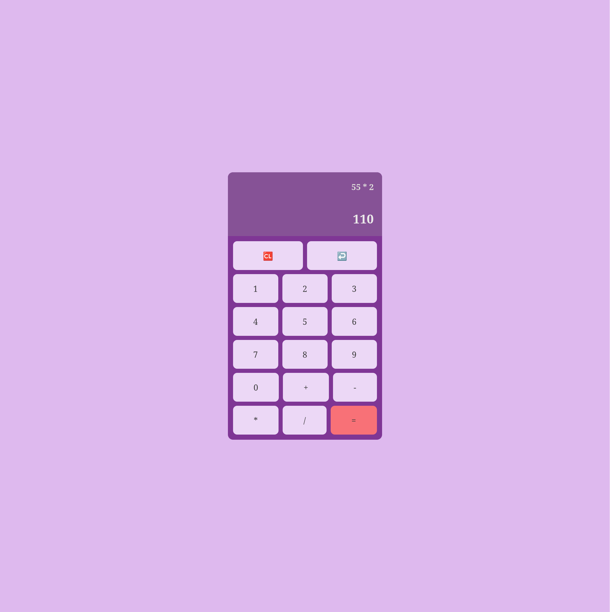

# Project: Calculator

This is a browser calculator created as a part of [The Odin Project's Foundations Course.](https://www.theodinproject.com/lessons/foundations-etch-a-sketch)

## Screenshots

## Built with

- Vite with vanilla TS
- CSS Flexbox

## What I learned

- Dealing with complex boolean evaluation
- That I need to improve more in problem solving.
- Make sure to at least understand what I need to do plan a little bit before jumping mindlessly to coding

## Challenges Faced

I started with different approach in the start.
Creating separate variables for operands and operator and dealing with lot of strings.
I didn't like where this is going and felt something off with my approach and changed to use an array and push all the calculation inside the array.

Using an array make it easy to perform calculation and handle the clear and backspace features.

## Future Improvements

- Improve the UI
- Adding decimal point option.
- Adding keyboard support.

## License

This project is part of an educational curriculum and is free to use and modify for learning purposes.
